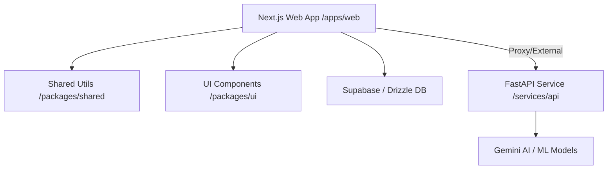

# 🏺 CultureLense

[](#)
[](https://opensource.org/licenses/MIT)
[](#)

**CultureLense** is a cutting-edge platform designed to bridge the gap between ancient heritage and modern technology. Leveraging AI and geospatial data, CultureLense allows users to discover, explore, and interact with cultural entities—from deities and mythology to historical temples and rituals.

---

## 🌐 Live Deployments

- **Production**: [culturelense.peridot.com.np](https://culturelense.peridot.com.np)
- **Vercel Mirror**: [culturelense.vercel.app](https://culturelense.vercel.app)

---

## ✨ Core Features

### 🔍 AI-Powered Cultural Identification
- **Instant Recognition**: Use your camera to scan sculptures, idols, or temple architecture and get immediate historical and mythological context.
- **Deep Mythology**: Access curated "Deep Mythology" content, including PDFs, videos, and audio guides.

### 🗺️ Interactive Cultural Maps
- **Geospatial Discovery**: Explore temples and historical sites on a dynamic map powered by Leaflet.
- **Visit History**: Keep track of the cultural landmarks you've visited with automatic geolocation tagging.

### 🏪 Cultural Marketplace (COD & Escrow)
- **Authentic Artifacts**: A marketplace for vendors to sell cultural items, sculptures, and literature.
- **Secure Transactions**: Supports **Cash on Delivery (COD)** and a secure **Escrow** system to ensure trust between buyers and vendors.
- **Vendor Dashboard**: Dedicated tools for vendors to manage listings and track orders.

### 📱 Progressive Web App (PWA)
- **Offline Access**: Install CultureLense as an app on your mobile device for on-the-go exploration.
- **Notifications**: Stay updated on new discoveries or marketplace orders.

---

## 🛠️ Technology Stack

| Layer | Technologies |
| :--- | :--- |
| **Frontend** | [Next.js 14](https://nextjs.org/) (App Router), [React](https://reactjs.org/), [Redux Toolkit](https://redux-toolkit.js.org/), [Framer Motion](https://www.framer.com/motion/) |
| **Styling** | [TailwindCSS](https://tailwindcss.com/), [Lucide React](https://lucide.dev/), [Shadcn UI](https://ui.shadcn.com/) |
| **Backend (Web)** | [Supabase](https://supabase.com/) (Auth, Storage), [Drizzle ORM](https://orm.drizzle.team/), [PostgreSQL](https://www.postgresql.org/) |
| **Backend (AI)** | [FastAPI](https://fastapi.tiangolo.com/), Python, [Google Gemini AI](https://ai.google.dev/) |
| **Monorepo** | [TurboRepo](https://turbo.build/repo), npm Workspaces |

---

## 🏗️ Project Architecture



- **`apps/web`**: The main user interface and core application logic.
- **`packages/shared`**: Type definitions, constants, and utility functions shared across the monorepo.
- **`packages/ui`**: A centralized, reusable React component library.
- **`services/api`**: Python-based AI service for cultural entity recognition and metadata processing.

---

## 🚀 Getting Started

### Prerequisites
- **Node.js**: v18+
- **npm**: v10+
- **Python**: 3.10+
- **Poetry**: Python dependency manager

### 1. Installation

**Install Frontend & Shared dependencies:**
```bash
npm install
```

**Install Backend (Python) dependencies:**
```bash
cd services/api
poetry install
```

### 2. Environment Configuration

Create a `.env` file in `apps/web` with the following variables:
```env
NEXT_PUBLIC_SUPABASE_URL=your_url
NEXT_PUBLIC_SUPABASE_ANON_KEY=your_key
DATABASE_URL=your_postgresql_url
```

### 3. Running Development Servers

**Start Frontend:**
```bash
# From root
npm run web
```

**Start AI Service:**
```bash
cd services/api
poetry run uvicorn app.main:app --reload
```

---

## 📊 Database Management

CultureLense uses **Drizzle ORM** for database migrations and schema management.

- **Generate Migrations**: `npm run db:generate`
- **Push Schema to DB**: `npm run db:push`
- **Seed Database**: `npm run db:seed`

---

## 📜 License

Distributed under the MIT License. See `LICENSE` for more information.

---

<p align="center">
  Developed with ❤️ by the CultureLense Team.
</p>
