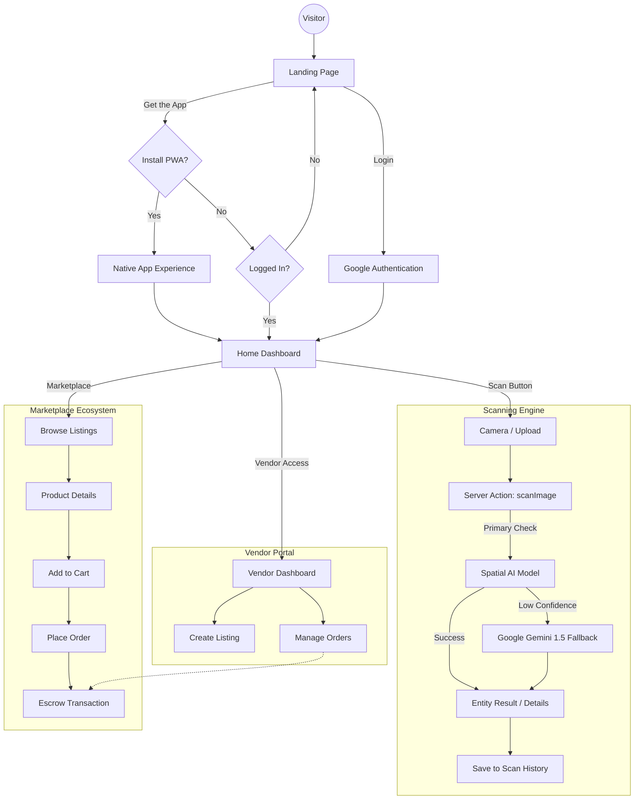

# CultureLense Project Flow

```mermaid
flowchart TD
    %% Nodes
    Visitor((Visitor))
    Landing[Landing Page]
    Login{Logged In?}
    Auth[Google Authentication]
    Home[Home Dashboard]

    %% PWA
    Install{Install PWA?}
    NativeApp[Native App Experience]

    %% Sub-Systems
    subgraph Scanning ["Scanning Engine"]
        Camera[Camera / Upload]
        ActionScan[Server Action: scanImage]
        SpatialAI[Spatial AI Model]
        Gemini[Google Gemini 1.5 Fallback]
        Result[Entity Result / Details]
        History[Save to Scan History]
    end

    subgraph Market ["Marketplace Ecosystem"]
        Browse[Browse Listings]
        Product[Product Details]
        Cart[Add to Cart]
        Order[Place Order]
        Escrow[Escrow Transaction]
    end

    subgraph VendorSystem ["Vendor Portal"]
        VendorDash[Vendor Dashboard]
        CreateList[Create Listing]
        ManageOrder[Manage Orders]
    end

    %% Flows
    Visitor --> Landing
    Landing -- "Get the App" --> Install
    Install -- Yes --> NativeApp --> Home
    Install -- No --> Login

    Login -- No --> Landing
    Login -- Yes --> Home
    Landing -- "Login" --> Auth --> Home

    %% Main Interactions
    Home -- "Scan Button" --> Camera
    Home -- "Marketplace" --> Browse
    Home -- "Vendor Access" --> VendorDash

    %% Scanning Logic
    Camera --> ActionScan
    ActionScan -- "Primary Check" --> SpatialAI
    SpatialAI -- "Low Confidence" --> Gemini
    SpatialAI -- "Success" --> Result
    Gemini --> Result
    Result --> History

    %% Marketplace Logic
    Browse --> Product --> Cart --> Order
    Order --> Escrow

    %% Vendor Logic
    VendorDash --> CreateList
    VendorDash --> ManageOrder
    ManageOrder -.-> Escrow
```
