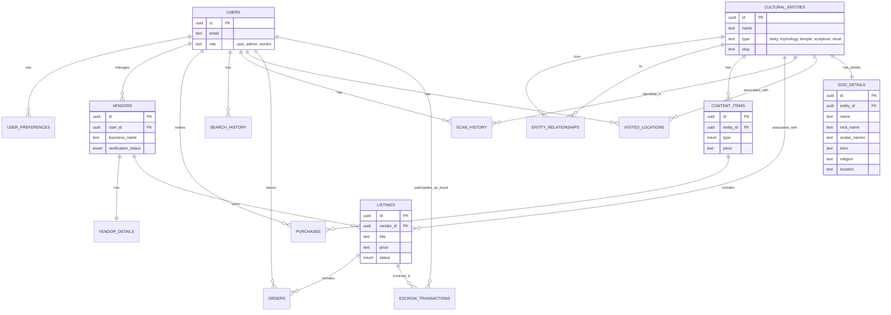

# CultureLense Database Schema

This document details the database schema for the CultureLense application. The schema is defined using Drizzle ORM in `src/schema.ts`.

## Entity Relationship Diagram

## Tables Overview

### Users & Authentication

- **`users`**: Core user table. Handles authentication (via email/password or OAuth) and roles (`user`, `admin`, `vendor`).
- **`user_preferences`**: Stores user-specific settings like language, notification preferences, and privacy settings. Linked 1:1 with `users`.

### Vendors & Marketplace

- **`vendors`**: Represents a user acting as a vendor. Linked 1:1 with `users`. Tracks verification status.
- **`vendor_details`**: Extended profile information for vendors (logos, contact info, social links). Linked 1:1 with `vendors`.
- **`listings`**: Items for sale by vendors. Linked to `vendors` and optionally to `cultural_entities` (e.g., a statue of Shiva).
- **`orders`**: Records physical item purchases. specific to a listing and a buyer.
- **`escrow_transactions`**: Manages secure payments for marketplace listings, tracking states like `held`, `released`, etc.

### Cultural Entities & Graph

- **`cultural_entities`**: The core knowledge base. Stores deities, temples, mythologies, etc. Includes `slug` for URLs and basic metadata.
- **`god_details`**: Extended information for deities attached to a cultural entity. Includes detailed fields (myths, journey, avatars, etc.).
- **`entity_relationships`**: A graph table defining connections between entities (e.g., "Shiva" -> `parent_of` -> "Ganesha"). Supports directed graph traversals.

### Content & Digital Purchases

- **`content_items`**: Digital content (audio, PDF, video) associated with cultural entities. Can be free or premium.
- **`purchases`**: specific records of users buying premium digital content.

### History & Tracking

- **`search_history`**: Logs user search queries for personalization.
- **`scan_history`**: Logs objects/entities identified via the camera/AR features.
- **`visited_locations`**: Tracks physical locations visited effectively, linking users to cultural entities based on geo-location.

## Enums

The schema uses several PostgreSQL enums to ensure data integrity:

- **`user_role`**: `admin`, `user`, `vendor`
- **`verification_status`**: `pending`, `verified`, `rejected`
- **`entity_type`**: `deity`, `mythology`, `temple`, `sculpture`, `ritual`
- **`content_type`**: `audio`, `pdf`, `video`, `deep_mythology`
- **`purchase_status`**: `pending`, `completed`, `failed`
- **`listing_status`**: `draft`, 'active', 'sold', 'archived'
- **`escrow_state`**: `held`, `released`, `refunded`, `disputed`
- **`order_status`**: `pending`, `processing`, `shipped`, 'delivered', 'cancelled'
